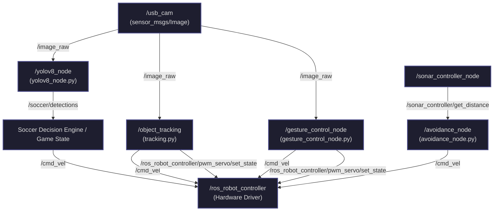

# Autonomous Soccer Robot Framework (ROS 2 Humble + Edge YOLOv8)

This repository contains the software workspace for an **Autonomous Soccer-Playing Robot** designed around the **Hiwonder TurboPi** (a Mecanum-wheeled robot powered by a Raspberry Pi 4/5). The project integrates real-time computer vision, closed-loop feedback controls, multi-sensor collision avoidance, and deep-learning gesture commands into a cohesive, modular **ROS 2 Humble** architecture.

> [!NOTE]
> This framework is designed for high-stakes autonomous robotic competition. Due to file size limitations, heavy assets like custom YOLOv8 model weights (`.onnx`) and training datasets must be manually restored before on-device deployment.

---

## 🏆 Key Engineering & AI Highlights (Portfolio Showcase)
* **Real-Time Edge AI Detection**: Ported a custom-trained **YOLOv8** model to run on-device via **ONNX Runtime (CPU Execution Provider)**, achieving low-latency inference on single-class ball detection directly on Raspberry Pi.
* **Omni-directional Holonomic Controls**: Developed custom kinematic mappings for the Mecanum chassis, supporting translation ($v_x$, $v_y$) and rotation ($\omega$) simultaneously.
* **Dual-Loop PID Target Tracking**: Implemented independent PID controllers for the pan-tilt servo gimbal (to keep the ball in frame) and the chassis locomotion (to approach and align with the ball).
* **Deep Learning Gestures**: Integrated **MediaPipe Hands** to map high-dimensional hand landmark vectors (1-6 finger poses) into immediate, holonomic movement vectors.
* **Resilient Middleware**: Built a robust heartbeat-monitoring mechanism across app nodes using custom services to ensure safe shutdowns and motor stops during communication loss.

---

## 🗺️ Software Architecture & ROS 2 Node Topology

Below is the high-level ROS 2 communication network representing the active nodes, service interfaces, and message pathways.



---

## 📦 Package Directory Structure

The workspace is organized into modular packages to isolate peripheral interfacing from higher-level decision making and driver SDKs:

* **[app](file:///d:/School/Capstone/robotCode/Capstone_Team7/app/)**: Core decision, navigation, and visual intelligence behaviors.
  * [yolov8_node.py](file:///d:/School/Capstone/robotCode/Capstone_Team7/app/app/yolov8_node.py): Handles image preprocessing (BGR to RGB scaling, normalization, $640 \times 640$ resizing), ONNX execution, Non-Maximum Suppression (NMS), and output bounding box formatting.
  * [tracking.py](file:///d:/School/Capstone/robotCode/Capstone_Team7/app/app/tracking.py): Implements color-based visual servoing. Includes PID stabilization loops to maintain center lock on target coordinates.
  * [gesture_control_node.py](file:///d:/School/Capstone/robotCode/Capstone_Team7/app/app/gesture_control_node.py): Extracts 2D joint-angle vectors from MediaPipe's hand landmarks to categorize gestures and issue holonomic command velocities.
  * [avoidance_node.py](file:///d:/School/Capstone/robotCode/Capstone_Team7/app/app/avoidance_node.py): Utilizes sonar sensors to implement reactive obstacle avoidance routines.
  * [line_following.py](file:///d:/School/Capstone/robotCode/Capstone_Team7/app/app/line_following.py): Multi-ROI binary classification to follow lines.
  * [qrcode.py](file:///d:/School/Capstone/robotCode/Capstone_Team7/app/app/qrcode.py): Navigational command reading via QR/Barcode tags using Pyzbar.
* **[bringup](file:///d:/School/Capstone/robotCode/Capstone_Team7/bringup/)**: Orchestrator package containing main launch files and startup health checks.
  * [bringup.launch.py](file:///d:/School/Capstone/robotCode/Capstone_Team7/bringup/launch/bringup.launch.py): Launches drivers, camera feeds, websocket bridge servers, and application nodes.
* **[driver](file:///d:/School/Capstone/robotCode/Capstone_Team7/driver/)**: Low-level hardware abstractions. Includes [sdk/](file:///d:/School/Capstone/robotCode/Capstone_Team7/driver/sdk/) (PWM servo interfaces, sonar bindings, I2C/Serial communication) and `/ros_robot_controller` which translates ROS topics (`cmd_vel`, servo states) into hardware PWM and motor voltages.
* **[interfaces](file:///d:/School/Capstone/robotCode/Capstone_Team7/interfaces/)**: Defines custom messages and services (e.g., [ObjectsInfo.msg](file:///d:/School/Capstone/robotCode/Capstone_Team7/interfaces/msg/ObjectsInfo.msg) and [ObjectInfo.msg](file:///d:/School/Capstone/robotCode/Capstone_Team7/interfaces/msg/ObjectInfo.msg) for soccer detections).
* **[peripherals](file:///d:/School/Capstone/robotCode/Capstone_Team7/peripherals/)**: Launch configurations and drivers for physical sensors (camera, sonar, IMU).

---

## 🛠️ Detailed Module Breakdown

### ⚽ 1. Custom YOLOv8 Soccer Ball Detection
* **Model Pipeline**: Captured raw frames via [usb_cam](file:///d:/School/Capstone/robotCode/Capstone_Team7/peripherals/) at $640 \times 480$ resolution. Preprocessed frames down to $640 \times 640$ floating-point tensors and evaluated them using ONNX Runtime.
* **Optimization**: Enabled `CPUExecutionProvider` optimizations specifically for single-board compute restrictions.
* **Output Interface**: Publishes custom `interfaces/msg/ObjectsInfo` messages containing bounding box coordinates ($x, y, w, h$) and classification confidence parameters.

### 🎮 2. MediaPipe-Based Hand Gesture Interface
Allows manual overriding or human-in-the-loop guidance using gestures:
* **Gesture Mappings**:
  * `1` / `2`: Translate Forward / Backward ($v_x = \pm 0.5\text{ m/s}$)
  * `3` / `4`: Strafe Left / Right ($v_y = \pm 0.5\text{ m/s}$)
  * `5` / `6`: Rotate Counterclockwise / Clockwise ($\omega = \pm 10.0\text{ rad/s}$)

### 🔄 3. PID-Based Visual Tracking
Maintains targeting lock on detected objects:
* **Camera Gimbal Control**: Runs horizontal/vertical PID controllers to adjust the pan-tilt servos ($Servo_x, Servo_y$) based on target center offsets.
* **Chassis Alignment Control**: Computes corrective Mecanum wheel commands to rotate/strafe the robot, aligning it with the targeting gimbal.

---

## 💡 Alternative Architectures: Standalone Tracker (Non-ROS)
In addition to the main ROS 2 Humble framework, this repository supports a lightweight standalone Python controller configuration (documented under the `kevin_robot` branch schema):
* **Main Script**: `zhui_yolo_host.py` acts as a single-process tracker running directly on the Raspberry Pi.
* **Functionality**:
  1. Captures camera frame feeds ($320 \times 320$).
  2. Runs a **YOLOv8n (NCNN Backend)** model to detect the soccer ball, goalpost, or opponent robots.
  3. Filters out false-positive bounding boxes (e.g., self-wheel reflections, low confidence markers).
  4. Calculates direct target pixel offsets and range estimates.
  5. Drives a finite-state machine (FSM): `SEARCH` $\rightarrow$ `CHASING` $\rightarrow$ `APPROACH` $\rightarrow$ `CLOSE` $\rightarrow$ `TOUCH` $\rightarrow$ `ARRIVED`.
  6. Sends raw serial control packets directly to the motor driver board over `/dev/rrc`.
* **Execution**:
  ```bash
  python3 zhui_yolo_host.py
  ```

---

## 🚀 Installation & Running

### Option A: Using Docker (Recommended)
This codebase is completely containerized, eliminating the need to set up a complex native ROS 2 Humble workspace on your host machine.

1. **Build and start the container in background**:
   ```bash
   docker compose up -d
   ```
2. **Access the container shell**:
   ```bash
   docker exec -it capstone_team7 bash
   ```
3. **Build the workspace inside the container**:
   ```bash
   colcon build --symlink-install
   source install/setup.bash
   ```

### Option B: Native Building
Ensure you have **ROS 2 Humble** installed on a Linux (Ubuntu 22.04) host, along with dependency packages:

1. **Install Dependencies**:
   ```bash
   pip3 install numpy pandas opencv-python mediapipe pyzbar onnxruntime
   sudo apt-get install ros-humble-cv-bridge ros-humble-image-transport ros-humble-rosbridge-server ros-humble-web-video-server
   ```
2. **Build Workspace**:
   ```bash
   # From workspace root
   colcon build --symlink-install
   source install/setup.bash
   ```

---

## 🏃 Launching the System

### 1. Bring up the Entire Robot Node Stack
This single command initiates motor controllers, camera nodes, websocket bridges, and application nodes:
```bash
ros2 launch bringup bringup.launch.py
```

### 2. Launch Specific Nodes Separately
* **Custom YOLOv8 Soccer Detections**:
  ```bash
  ros2 run app yolov8_node
  ```
* **Object Tracking / Visual Servoing**:
  ```bash
  ros2 launch app object_tracking.launch.py
  ```
* **Gesture Control**:
  ```bash
  ros2 launch app gesture_control_node.launch.py
  ```

---

## 🛡️ Life-Safety & Communication Heartbeat
Operating mecanum robots at high speeds presents kinetic hazards. To address this, the nodes implement a **Heartbeat class** ([common.py](file:///d:/School/Capstone/robotCode/Capstone_Team7/app/app/common.py)). If any control client disconnects or fails to send a pulse within **5 seconds**, the heartbeat responder automatically triggers an emergency service callback to stop the motors, home the servos, and shut down the active application node safely.
